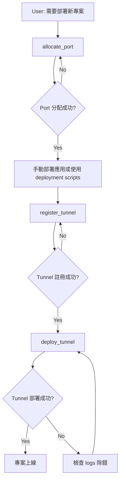

# MCP Tools API Specification

**文檔版本**: v1.0
**最後更新**: 2025-12-28
**狀態**: Design Phase

---

## 📖 Overview

本文檔詳細定義 Infrastructure MCP Server 提供的所有 tools，包括輸入參數、輸出格式、錯誤處理和使用範例。

### Tool 列表

1. **allocate_port** - Port 資源分配
2. **register_tunnel** - Cloudflare Tunnel 註冊
3. **deploy_tunnel** - Cloudflare Tunnel 部署到 VPS
4. **list_resources** - 資源使用查詢

---

## 🔧 Tool 1: allocate_port

### Description

為專案的特定服務分配一個可用的 port。支援用戶指定偏好 port（如果可用），否則自動從 port pool 分配下一個可用 port。

### Use Cases

- 新專案需要 port 運行 web server
- 同一專案內的多個服務（frontend, backend, admin）需要不同 ports
- 開發環境需要與生產環境不同的 port

### Input Schema

```json
{
  "name": "allocate_port",
  "description": "Allocate a port for a project service",
  "input_schema": {
    "type": "object",
    "properties": {
      "project": {
        "type": "string",
        "description": "Project name (e.g., 'my-app', 'my-app')",
        "required": true,
        "pattern": "^[a-z0-9-]+$"
      },
      "service": {
        "type": "string",
        "description": "Service name within the project (e.g., 'web-server', 'api', 'admin')",
        "required": true,
        "pattern": "^[a-z0-9-]+$"
      },
      "preferred_port": {
        "type": "integer",
        "description": "Preferred port number (optional). If available, will be allocated. If not, next available port will be used.",
        "required": false,
        "minimum": 3000,
        "maximum": 9999
      },
      "notes": {
        "type": "string",
        "description": "Optional notes about this port allocation",
        "required": false
      }
    }
  }
}
```

### Output Schema

**Success Response**:
```json
{
  "success": true,
  "allocated_port": 3000,
  "allocation_id": "alloc_20251228_120530_001",
  "project": "my-app",
  "service": "web-server",
  "allocated_at": "2025-12-28T12:05:30Z",
  "message": "Port 3000 allocated to my-app/web-server"
}
```

**Error Response**:
```json
{
  "success": false,
  "error": "PORT_ALREADY_ALLOCATED",
  "message": "Port 3000 is already allocated to another-project/api",
  "allocated_to": {
    "project": "another-project",
    "service": "api"
  },
  "suggestion": "Try without specifying preferred_port to get next available port"
}
```

### Error Codes

| Error Code | Description | Solution |
|-----------|-------------|----------|
| `PORT_ALREADY_ALLOCATED` | Preferred port is already in use | Omit preferred_port or choose different port |
| `PORT_OUT_OF_RANGE` | Port number outside 3000-9999 range | Use port within valid range |
| `INVALID_PROJECT_NAME` | Project name contains invalid characters | Use lowercase letters, numbers, hyphens only |
| `PORT_POOL_EXHAUSTED` | No more ports available in the pool | Add more VPS servers or reclaim unused ports |

### Usage Examples

#### Example 1: 分配偏好 port（成功）

```
User: 我的專案 my-app 需要一個 port 來運行 web server，希望使用 3000

Claude uses allocate_port:
{
  "project": "my-app",
  "service": "web-server",
  "preferred_port": 3000,
  "notes": "Main Flask application server"
}

Result:
{
  "success": true,
  "allocated_port": 3000,
  "allocation_id": "alloc_20251228_120530_001",
  "message": "Port 3000 allocated to my-app/web-server"
}
```

#### Example 2: 分配偏好 port（已被使用，自動分配下一個）

```
User: pac 專案需要一個 port，希望用 8080

Claude uses allocate_port:
{
  "project": "pac",
  "service": "dashboard",
  "preferred_port": 8080
}

Result:
{
  "success": false,
  "error": "PORT_ALREADY_ALLOCATED",
  "message": "Port 8080 is already allocated to pac/dashboard (existing)",
  "suggestion": "Try without specifying preferred_port"
}

Claude retries without preferred_port:
{
  "project": "pac",
  "service": "api"
}

Result:
{
  "success": true,
  "allocated_port": 3001,
  "allocation_id": "alloc_20251228_120545_002",
  "message": "Port 3001 allocated to pac/api"
}
```

#### Example 3: 自動分配（不指定偏好）

```
User: sandbox 專案需要兩個 ports，一個給 frontend，一個給 backend

Claude uses allocate_port (first call):
{
  "project": "sandbox",
  "service": "frontend"
}

Result:
{
  "success": true,
  "allocated_port": 5000,
  "message": "Port 5000 allocated to sandbox/frontend"
}

Claude uses allocate_port (second call):
{
  "project": "sandbox",
  "service": "backend"
}

Result:
{
  "success": true,
  "allocated_port": 5001,
  "message": "Port 5001 allocated to sandbox/backend"
}
```

---

## 🔧 Tool 2: register_tunnel

### Description

註冊一個 Cloudflare Tunnel 配置，包括建立 config YAML、設定 DNS CNAME 記錄、準備 systemd service 檔案。

### Use Cases

- 新專案需要對外提供服務（透過 Zero Trust）
- 現有專案新增 subdomain
- 更新現有 tunnel 的 target port

### Input Schema

```json
{
  "name": "register_tunnel",
  "description": "Register a Cloudflare Tunnel configuration",
  "input_schema": {
    "type": "object",
    "properties": {
      "project": {
        "type": "string",
        "description": "Project name",
        "required": true
      },
      "tunnel_name": {
        "type": "string",
        "description": "Tunnel identifier (will be used for config file and systemd service)",
        "required": true,
        "pattern": "^[a-z0-9-]+$"
      },
      "hostname": {
        "type": "string",
        "description": "Full hostname (e.g., 'myapp.your-domain.com', 'api.your-domain.com')",
        "required": true,
        "pattern": "^[a-z0-9.-]+\\.your-domain\\.com$"
      },
      "target_port": {
        "type": "integer",
        "description": "Local port to forward traffic to (must be allocated first via allocate_port)",
        "required": true,
        "minimum": 3000,
        "maximum": 9999
      },
      "vps_server": {
        "type": "string",
        "description": "VPS server to deploy this tunnel on",
        "required": false,
        "default": "prod",
        "enum": ["prod"]
      },
      "use_existing_tunnel_id": {
        "type": "string",
        "description": "If provided, use existing tunnel credentials instead of creating new tunnel",
        "required": false
      }
    }
  }
}
```

### Output Schema

**Success Response**:
```json
{
  "success": true,
  "tunnel_id": "tunnel_20251228_120600_001",
  "tunnel_name": "myapp",
  "hostname": "myapp.your-domain.com",
  "target_service": "http://localhost:3000",
  "config_generated": true,
  "config_path": "/home/your_user/.cloudflared/config-myapp.yml",
  "systemd_service": "cloudflared-myapp.service",
  "dns_record": {
    "type": "CNAME",
    "name": "myapp",
    "target": "abc123-def456.cfargotunnel.com",
    "proxied": true,
    "configured": true
  },
  "next_steps": [
    "Deploy tunnel to VPS using deploy_tunnel tool",
    "Or manually: scp config to VPS and create systemd service"
  ],
  "message": "Tunnel myapp registered successfully for myapp.your-domain.com -> localhost:3000"
}
```

**Error Response**:
```json
{
  "success": false,
  "error": "HOSTNAME_ALREADY_USED",
  "message": "Hostname myapp.your-domain.com is already registered to another tunnel",
  "existing_tunnel": {
    "tunnel_name": "myapp-old",
    "project": "old-project"
  },
  "suggestion": "Choose a different subdomain or release the existing tunnel first"
}
```

### Error Codes

| Error Code | Description | Solution |
|-----------|-------------|----------|
| `HOSTNAME_ALREADY_USED` | Subdomain already registered | Choose different subdomain |
| `PORT_NOT_ALLOCATED` | Target port not allocated to this project | Run allocate_port first |
| `INVALID_DOMAIN` | Domain not in allowed list (your-domain.com) | Use valid domain |
| `CLOUDFLARE_API_ERROR` | Failed to create DNS record | Check Cloudflare API token and permissions |
| `TUNNEL_NAME_EXISTS` | Tunnel name already used | Choose different tunnel name |

### Usage Examples

#### Example 1: 註冊新 tunnel（完整流程）

```
User: my-app 專案已經分配了 port 3000，現在需要設定 tunnel，domain 用 my-app.your-domain.com

Claude uses register_tunnel:
{
  "project": "my-app",
  "tunnel_name": "my-app",
  "hostname": "my-app.your-domain.com",
  "target_port": 3000,
  "vps_server": "prod"
}

Result:
{
  "success": true,
  "tunnel_id": "tunnel_20251228_120600_001",
  "tunnel_name": "my-app",
  "hostname": "my-app.your-domain.com",
  "config_path": "/home/your_user/.cloudflared/config-my-app.yml",
  "dns_record": {
    "type": "CNAME",
    "name": "my-app",
    "target": "abc123-def456.cfargotunnel.com",
    "configured": true
  },
  "message": "Tunnel registered. Next: deploy to VPS using deploy_tunnel tool"
}
```

#### Example 2: 使用現有 tunnel credentials

```
User: pac 專案要遷移到 prod，使用現有的 tunnel ID 0a1a62fb-0ad5-4f6a-9e8c-f0129fcbaf92

Claude uses register_tunnel:
{
  "project": "pac",
  "tunnel_name": "pac",
  "hostname": "pac.your-domain.com",
  "target_port": 8080,
  "vps_server": "prod",
  "use_existing_tunnel_id": "0a1a62fb-0ad5-4f6a-9e8c-f0129fcbaf92"
}

Result:
{
  "success": true,
  "tunnel_id": "tunnel_20251228_120615_002",
  "tunnel_name": "pac",
  "hostname": "pac.your-domain.com",
  "config_path": "/home/your_user/.cloudflared/config-pac.yml",
  "credentials_file": "/home/your_user/.cloudflared/0a1a62fb-0ad5-4f6a-9e8c-f0129fcbaf92.json",
  "message": "Tunnel registered using existing credentials"
}
```

---

## 🔧 Tool 3: deploy_tunnel

### Description

部署已註冊的 Cloudflare Tunnel 到 VPS 伺服器，包括：
- 複製 tunnel config 到 VPS
- 建立 cloudflared systemd service
- 啟動 tunnel service

**注意**：此 tool 只部署 tunnel，不部署應用程式。應用程式請使用 `deploy_service` tool 或自行部署。

### Use Cases

- 部署 Cloudflare Tunnel 到 VPS
- 啟動已註冊的 tunnel service
- 在 VPS 重啟後重新部署 tunnel

### Input Schema

```json
{
  "name": "deploy_tunnel",
  "description": "Deploy Cloudflare Tunnel to VPS server",
  "input_schema": {
    "type": "object",
    "properties": {
      "tunnel_name": {
        "type": "string",
        "description": "Tunnel name (must be registered first via register_tunnel)",
        "required": true
      },
      "server": {
        "type": "string",
        "description": "Target VPS server",
        "required": false,
        "default": "prod",
        "enum": ["prod"]
      }
    }
  }
}
```

### Output Schema

**Success Response**:
```json
{
  "success": true,
  "tunnel_name": "myapp",
  "server": "prod",
  "service_name": "cloudflared-myapp.service",
  "status": "running",
  "hostname": "myapp.your-domain.com",
  "connections": 4,
  "config_path": "/home/your_user/.cloudflared/config-myapp.yml",
  "logs_command": "sudo journalctl -u cloudflared-myapp -f",
  "message": "Tunnel deployed and started successfully"
}
```

**Error Response**:
```json
{
  "success": false,
  "error": "TUNNEL_NOT_REGISTERED",
  "message": "Tunnel 'myapp' not found in registry",
  "suggestion": "Run register_tunnel first to register this tunnel"
}
```

### Error Codes

| Error Code | Description | Solution |
|-----------|-------------|----------|
| `TUNNEL_NOT_REGISTERED` | Tunnel not registered | Run register_tunnel first |
| `SSH_CONNECTION_FAILED` | Cannot connect to VPS | Check VPS status and SSH credentials |
| `CONFIG_FILE_NOT_FOUND` | Tunnel config file not found | Check register_tunnel completed successfully |
| `SERVICE_START_FAILED` | cloudflared service failed to start | SSH to server and check logs: `sudo journalctl -u cloudflared-{name} -n 50` |
| `CREDENTIALS_NOT_FOUND` | Tunnel credentials file not found | Check tunnel was created properly in Cloudflare |

### Usage Examples

#### Example 1: 部署已註冊的 tunnel

```
User: 部署 my-app tunnel 到 prod

Prerequisites:
- Tunnel 'my-app' already registered via register_tunnel
- Application already deployed (manually or via deployment scripts)

Claude uses deploy_tunnel:
{
  "tunnel_name": "my-app",
  "server": "prod"
}

Result:
{
  "success": true,
  "tunnel_name": "my-app",
  "server": "prod",
  "service_name": "cloudflared-my-app.service",
  "status": "running",
  "hostname": "my-app.your-domain.com",
  "connections": 4,
  "message": "Tunnel deployed and started successfully"
}
```

#### Example 2: 部署 tunnel 到 prod（default server）

```
User: 啟動 pac tunnel

Claude uses deploy_tunnel:
{
  "tunnel_name": "pac"
}

Result:
{
  "success": true,
  "tunnel_name": "pac",
  "server": "prod",
  "service_name": "cloudflared-pac.service",
  "status": "running",
  "hostname": "pac.your-domain.com",
  "connections": 4,
  "message": "Tunnel deployed and started successfully"
}
```

---

## 🔧 Tool 4: list_resources

### Description

查詢資源使用狀況，包括已分配的 ports、已註冊的 tunnels、已部署的應用。支援過濾和統計。

### Use Cases

- 檢查某個 port 是否已被使用
- 查看專案使用了哪些資源
- 查看某台 VPS 上部署了哪些應用
- 資源使用統計

### Input Schema

```json
{
  "name": "list_resources",
  "description": "List infrastructure resource allocations",
  "input_schema": {
    "type": "object",
    "properties": {
      "resource_type": {
        "type": "string",
        "description": "Type of resources to list",
        "required": false,
        "default": "all",
        "enum": ["all", "ports", "tunnels", "deployments"]
      },
      "project": {
        "type": "string",
        "description": "Filter by project name",
        "required": false
      },
      "server": {
        "type": "string",
        "description": "Filter by VPS server",
        "required": false
      },
      "status": {
        "type": "string",
        "description": "Filter by resource status",
        "required": false,
        "enum": ["all", "active", "inactive", "failed"]
      },
      "include_released": {
        "type": "boolean",
        "description": "Include released/deallocated resources",
        "required": false,
        "default": false
      }
    }
  }
}
```

### Output Schema

```json
{
  "success": true,
  "resources": {
    "ports": [
      {
        "port": 3000,
        "project": "my-app",
        "service": "web-server",
        "allocation_id": "alloc_20251228_120530_001",
        "allocated_at": "2025-12-28T12:05:30Z",
        "status": "in-use"
      },
      {
        "port": 8080,
        "project": "pac",
        "service": "dashboard",
        "allocation_id": "alloc_20251220_100000_001",
        "allocated_at": "2025-12-20T10:00:00Z",
        "status": "in-use"
      },
      {
        "port": 5000,
        "project": "sandbox",
        "service": "web",
        "allocation_id": "alloc_20251220_100100_002",
        "allocated_at": "2025-12-20T10:01:00Z",
        "status": "in-use"
      }
    ],
    "tunnels": [
      {
        "tunnel_name": "my-app",
        "hostname": "my-app.your-domain.com",
        "project": "my-app",
        "target_port": 3000,
        "server": "prod",
        "tunnel_id": "tunnel_20251228_120600_001",
        "registered_at": "2025-12-28T12:06:00Z",
        "status": "active"
      },
      {
        "tunnel_name": "pac",
        "hostname": "pac.your-domain.com",
        "project": "pac",
        "target_port": 8080,
        "server": "prod",
        "status": "active"
      },
      {
        "tunnel_name": "sandbox",
        "hostname": "sandbox.your-domain.com",
        "project": "sandbox",
        "target_port": 5000,
        "server": "prod",
        "status": "active"
      }
    ],
    "deployments": [
      {
        "project": "my-app",
        "server": "prod",
        "service_name": "my-app-web.service",
        "deployment_type": "flask_app",
        "port": 3000,
        "deployed_at": "2025-12-28T12:06:30Z",
        "status": "running",
        "uptime": "2h 15m"
      },
      {
        "project": "pac",
        "server": "prod",
        "service_name": "pac-web.service",
        "deployment_type": "flask_app",
        "port": 8080,
        "deployed_at": "2025-12-20T10:30:00Z",
        "status": "running",
        "uptime": "8d 4h"
      }
    ]
  },
  "summary": {
    "total_ports_allocated": 3,
    "ports_in_use": 3,
    "ports_available": 6997,
    "total_tunnels": 3,
    "tunnels_active": 3,
    "total_deployments": 2,
    "deployments_running": 2,
    "servers": {
      "prod": {
        "deployments": 2,
        "ports_used": 3,
        "tunnels": 3,
        "status": "healthy"
      }
    }
  },
  "message": "Resource query completed"
}
```

### Usage Examples

#### Example 1: 查看所有資源

```
User: 顯示所有基礎設施資源使用狀況

Claude uses list_resources:
{
  "resource_type": "all"
}

Result: (see Output Schema above)
```

#### Example 2: 查看特定專案的資源

```
User: my-app 專案使用了哪些資源？

Claude uses list_resources:
{
  "resource_type": "all",
  "project": "my-app"
}

Result:
{
  "success": true,
  "resources": {
    "ports": [
      {
        "port": 3000,
        "service": "web-server",
        "status": "in-use"
      }
    ],
    "tunnels": [
      {
        "tunnel_name": "my-app",
        "hostname": "my-app.your-domain.com",
        "target_port": 3000,
        "status": "active"
      }
    ],
    "deployments": [
      {
        "server": "prod",
        "service_name": "my-app-web.service",
        "status": "running"
      }
    ]
  },
  "summary": {
    "total_resources": 3,
    "project": "my-app"
  }
}
```

#### Example 3: 檢查特定 port 是否可用

```
User: Port 3500 可以用嗎？

Claude uses list_resources:
{
  "resource_type": "ports"
}

Claude analyzes result:
- Port 3500 not in the allocated ports list
- Therefore it's available

Response: "Port 3500 目前可用，尚未被任何專案使用。"
```

#### Example 4: 查看 prod 伺服器上的部署

```
User: prod 上部署了哪些應用？

Claude uses list_resources:
{
  "resource_type": "deployments",
  "server": "prod"
}

Result:
{
  "success": true,
  "resources": {
    "deployments": [
      {
        "project": "my-app",
        "service_name": "my-app-web.service",
        "status": "running",
        "port": 3000
      },
      {
        "project": "pac",
        "service_name": "pac-web.service",
        "status": "running",
        "port": 8080
      },
      {
        "project": "sandbox",
        "service_name": "sandbox-web.service",
        "status": "running",
        "port": 5000
      }
    ]
  },
  "summary": {
    "server": "prod",
    "total_deployments": 3,
    "running": 3
  }
}
```

---

## 🔄 Tool Interaction Workflows

### 完整部署流程（新專案）



**實際範例**:
```
1. User: "部署 my-new-app 到 prod，使用 domain mynewapp.your-domain.com"

2. Claude:
   Step 1: allocate_port
   {
     "project": "my-new-app",
     "service": "web",
     "preferred_port": 3500
   }
   → Port 3500 allocated

   Step 2: register_tunnel
   {
     "project": "my-new-app",
     "tunnel_name": "mynewapp",
     "hostname": "mynewapp.your-domain.com",
     "target_port": 3500
   }
   → Tunnel registered, DNS configured

   Step 3: 部署應用（手動或使用 deployment scripts）
   bash scripts/deploy/deploy-flask.sh \
     --project my-new-app \
     --port 3500 \
     --server prod
   → Application deployed

   Step 4: deploy_tunnel
   {
     "tunnel_name": "mynewapp",
     "server": "prod"
   }
   → Tunnel deployed successfully

3. Result: "my-new-app 已成功部署到 prod，可透過 https://mynewapp.your-domain.com 訪問"
```

---

## 📚 Best Practices

### 1. 資源命名規範

**Project names**:
- 小寫字母、數字、連字號
- 範例: `my-app`, `pac`, `sandbox`

**Service names**:
- 描述性名稱
- 範例: `web-server`, `api`, `admin`, `worker`

**Tunnel names**:
- 通常與 project name 相同或簡短版本
- 範例: `my-app`, `pac`, `sandbox`, `myapp`

**Hostnames**:
- 使用 `<name>.your-domain.com` 作為服務網址
- 範例: `my-app.your-domain.com`, `api.your-domain.com`

### 2. Port 分配策略

- **Preferred port** 優先使用標準 ports:
  - 3000: 常見 Node.js/React dev server
  - 5000: 常見 Flask default
  - 8080: 常見 HTTP alternate
  - 8000: 常見 Django default

- **Auto-allocation** 當偏好 port 不可用時，讓系統自動分配

### 3. 錯誤處理

- 總是檢查 tool 回應的 `success` 欄位
- 當 `success: false` 時，讀取 `error` 和 `message` 了解原因
- 根據 `suggestion` 欄位調整策略

### 4. 資源清理

未來將提供 `release_port`, `unregister_tunnel`, `undeploy_from_vps` tools 來回收資源。

---

## 📝 Changelog

### v1.0 (2025-12-28)
- 初始版本
- 定義 4 個核心 MCP tools
- 完整 API schema 和使用範例

---

**文檔維護**: 隨 MCP Server 實作更新
**下次審查**: Phase 1 實作完成後
**維護責任**: Infrastructure Team
