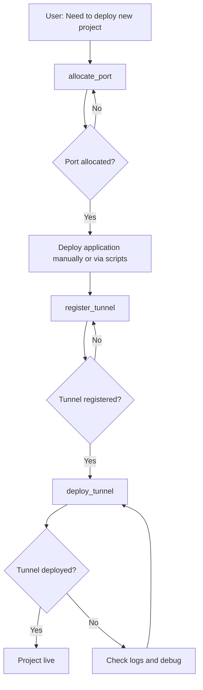

# MCP Tools API Specification

**Document version**: v1.0
**Last updated**: 2025-12-28
**Status**: Design Phase

---

## 📖 Overview

This document defines all tools provided by the Infrastructure MCP Server, including input parameters, output formats, error handling, and usage examples.

### Tool List

1. **allocate_port** - Port resource allocation
2. **register_tunnel** - Cloudflare Tunnel registration
3. **deploy_tunnel** - Deploy Cloudflare Tunnel to VPS
4. **list_resources** - Resource usage query

---

## 🔧 Tool 1: allocate_port

### Description

Allocates an available port for a specific project service. Supports a preferred port (used if available); otherwise automatically allocates the next available port from the pool.

### Use Cases

- New project needs a port to run a web server
- Multiple services within a project (frontend, backend, admin) need separate ports
- Development environment needs a different port from production

### Input Schema

```json
{
  "name": "allocate_port",
  "description": "Allocate a port for a project service",
  "input_schema": {
    "type": "object",
    "properties": {
      "project": {
        "type": "string",
        "description": "Project name (e.g., 'my-app', 'my-app')",
        "required": true,
        "pattern": "^[a-z0-9-]+$"
      },
      "service": {
        "type": "string",
        "description": "Service name within the project (e.g., 'web-server', 'api', 'admin')",
        "required": true,
        "pattern": "^[a-z0-9-]+$"
      },
      "preferred_port": {
        "type": "integer",
        "description": "Preferred port number (optional). If available, will be allocated. If not, next available port will be used.",
        "required": false,
        "minimum": 3000,
        "maximum": 9999
      },
      "notes": {
        "type": "string",
        "description": "Optional notes about this port allocation",
        "required": false
      }
    }
  }
}
```

### Output Schema

**Success Response**:
```json
{
  "success": true,
  "allocated_port": 3000,
  "allocation_id": "alloc_20251228_120530_001",
  "project": "my-app",
  "service": "web-server",
  "allocated_at": "2025-12-28T12:05:30Z",
  "message": "Port 3000 allocated to my-app/web-server"
}
```

**Error Response**:
```json
{
  "success": false,
  "error": "PORT_ALREADY_ALLOCATED",
  "message": "Port 3000 is already allocated to another-project/api",
  "allocated_to": {
    "project": "another-project",
    "service": "api"
  },
  "suggestion": "Try without specifying preferred_port to get next available port"
}
```

### Error Codes

| Error Code | Description | Solution |
|-----------|-------------|----------|
| `PORT_ALREADY_ALLOCATED` | Preferred port is already in use | Omit preferred_port or choose different port |
| `PORT_OUT_OF_RANGE` | Port number outside 3000-9999 range | Use port within valid range |
| `INVALID_PROJECT_NAME` | Project name contains invalid characters | Use lowercase letters, numbers, hyphens only |
| `PORT_POOL_EXHAUSTED` | No more ports available in the pool | Add more VPS servers or reclaim unused ports |

### Usage Examples

#### Example 1: Allocate preferred port (success)

```
User: My project my-app needs a port to run a web server, I'd like port 3000

Claude uses allocate_port:
{
  "project": "my-app",
  "service": "web-server",
  "preferred_port": 3000,
  "notes": "Main Flask application server"
}

Result:
{
  "success": true,
  "allocated_port": 3000,
  "allocation_id": "alloc_20251228_120530_001",
  "message": "Port 3000 allocated to my-app/web-server"
}
```

#### Example 2: Preferred port taken — auto-allocate next available

```
User: The pac project needs a port, I'd like 8080

Claude uses allocate_port:
{
  "project": "pac",
  "service": "dashboard",
  "preferred_port": 8080
}

Result:
{
  "success": false,
  "error": "PORT_ALREADY_ALLOCATED",
  "message": "Port 8080 is already allocated to pac/dashboard (existing)",
  "suggestion": "Try without specifying preferred_port"
}

Claude retries without preferred_port:
{
  "project": "pac",
  "service": "api"
}

Result:
{
  "success": true,
  "allocated_port": 3001,
  "allocation_id": "alloc_20251228_120545_002",
  "message": "Port 3001 allocated to pac/api"
}
```

#### Example 3: Auto-allocate (no preferred port)

```
User: The sandbox project needs two ports — one for frontend, one for backend

Claude uses allocate_port (first call):
{
  "project": "sandbox",
  "service": "frontend"
}

Result:
{
  "success": true,
  "allocated_port": 5000,
  "message": "Port 5000 allocated to sandbox/frontend"
}

Claude uses allocate_port (second call):
{
  "project": "sandbox",
  "service": "backend"
}

Result:
{
  "success": true,
  "allocated_port": 5001,
  "message": "Port 5001 allocated to sandbox/backend"
}
```

---

## 🔧 Tool 2: register_tunnel

### Description

Registers a Cloudflare Tunnel configuration — creates the config YAML, sets up a DNS CNAME record, and prepares the systemd service file.

### Use Cases

- New project needs to be accessible externally (via Zero Trust)
- Adding a new subdomain to an existing project
- Updating the target port of an existing tunnel

### Input Schema

```json
{
  "name": "register_tunnel",
  "description": "Register a Cloudflare Tunnel configuration",
  "input_schema": {
    "type": "object",
    "properties": {
      "project": {
        "type": "string",
        "description": "Project name",
        "required": true
      },
      "tunnel_name": {
        "type": "string",
        "description": "Tunnel identifier (will be used for config file and systemd service)",
        "required": true,
        "pattern": "^[a-z0-9-]+$"
      },
      "hostname": {
        "type": "string",
        "description": "Full hostname (e.g., 'myapp.your-domain.com', 'api.your-domain.com')",
        "required": true,
        "pattern": "^[a-z0-9.-]+\\.your-domain\\.com$"
      },
      "target_port": {
        "type": "integer",
        "description": "Local port to forward traffic to (must be allocated first via allocate_port)",
        "required": true,
        "minimum": 3000,
        "maximum": 9999
      },
      "vps_server": {
        "type": "string",
        "description": "VPS server to deploy this tunnel on",
        "required": false,
        "default": "prod",
        "enum": ["prod"]
      },
      "use_existing_tunnel_id": {
        "type": "string",
        "description": "If provided, use existing tunnel credentials instead of creating new tunnel",
        "required": false
      }
    }
  }
}
```

### Output Schema

**Success Response**:
```json
{
  "success": true,
  "tunnel_id": "tunnel_20251228_120600_001",
  "tunnel_name": "myapp",
  "hostname": "myapp.your-domain.com",
  "target_service": "http://localhost:3000",
  "config_generated": true,
  "config_path": "/home/your_user/.cloudflared/config-myapp.yml",
  "systemd_service": "cloudflared-myapp.service",
  "dns_record": {
    "type": "CNAME",
    "name": "myapp",
    "target": "abc123-def456.cfargotunnel.com",
    "proxied": true,
    "configured": true
  },
  "next_steps": [
    "Deploy tunnel to VPS using deploy_tunnel tool",
    "Or manually: scp config to VPS and create systemd service"
  ],
  "message": "Tunnel myapp registered successfully for myapp.your-domain.com -> localhost:3000"
}
```

**Error Response**:
```json
{
  "success": false,
  "error": "HOSTNAME_ALREADY_USED",
  "message": "Hostname myapp.your-domain.com is already registered to another tunnel",
  "existing_tunnel": {
    "tunnel_name": "myapp-old",
    "project": "old-project"
  },
  "suggestion": "Choose a different subdomain or release the existing tunnel first"
}
```

### Error Codes

| Error Code | Description | Solution |
|-----------|-------------|----------|
| `HOSTNAME_ALREADY_USED` | Subdomain already registered | Choose different subdomain |
| `PORT_NOT_ALLOCATED` | Target port not allocated to this project | Run allocate_port first |
| `INVALID_DOMAIN` | Domain not in allowed list (your-domain.com) | Use valid domain |
| `CLOUDFLARE_API_ERROR` | Failed to create DNS record | Check Cloudflare API token and permissions |
| `TUNNEL_NAME_EXISTS` | Tunnel name already used | Choose different tunnel name |

### Usage Examples

#### Example 1: Register a new tunnel (full workflow)

```
User: The my-app project already has port 3000 allocated, now needs a tunnel at my-app.your-domain.com

Claude uses register_tunnel:
{
  "project": "my-app",
  "tunnel_name": "my-app",
  "hostname": "my-app.your-domain.com",
  "target_port": 3000,
  "vps_server": "prod"
}

Result:
{
  "success": true,
  "tunnel_id": "tunnel_20251228_120600_001",
  "tunnel_name": "my-app",
  "hostname": "my-app.your-domain.com",
  "config_path": "/home/your_user/.cloudflared/config-my-app.yml",
  "dns_record": {
    "type": "CNAME",
    "name": "my-app",
    "target": "abc123-def456.cfargotunnel.com",
    "configured": true
  },
  "message": "Tunnel registered. Next: deploy to VPS using deploy_tunnel tool"
}
```

#### Example 2: Use existing tunnel credentials

```
User: The pac project is migrating to prod using existing tunnel ID 0a1a62fb-0ad5-4f6a-9e8c-f0129fcbaf92

Claude uses register_tunnel:
{
  "project": "pac",
  "tunnel_name": "pac",
  "hostname": "pac.your-domain.com",
  "target_port": 8080,
  "vps_server": "prod",
  "use_existing_tunnel_id": "0a1a62fb-0ad5-4f6a-9e8c-f0129fcbaf92"
}

Result:
{
  "success": true,
  "tunnel_id": "tunnel_20251228_120615_002",
  "tunnel_name": "pac",
  "hostname": "pac.your-domain.com",
  "config_path": "/home/your_user/.cloudflared/config-pac.yml",
  "credentials_file": "/home/your_user/.cloudflared/0a1a62fb-0ad5-4f6a-9e8c-f0129fcbaf92.json",
  "message": "Tunnel registered using existing credentials"
}
```

---

## 🔧 Tool 3: deploy_tunnel

### Description

Deploys a registered Cloudflare Tunnel to a VPS server:
- Copies tunnel config to the VPS
- Creates the cloudflared systemd service
- Starts the tunnel service

**Note**: This tool deploys only the tunnel, not the application. Use `deploy_service` or deploy manually for the application.

### Use Cases

- Deploy a Cloudflare Tunnel to a VPS
- Start a registered tunnel service
- Re-deploy a tunnel after a VPS reboot

### Input Schema

```json
{
  "name": "deploy_tunnel",
  "description": "Deploy Cloudflare Tunnel to VPS server",
  "input_schema": {
    "type": "object",
    "properties": {
      "tunnel_name": {
        "type": "string",
        "description": "Tunnel name (must be registered first via register_tunnel)",
        "required": true
      },
      "server": {
        "type": "string",
        "description": "Target VPS server",
        "required": false,
        "default": "prod",
        "enum": ["prod"]
      }
    }
  }
}
```

### Output Schema

**Success Response**:
```json
{
  "success": true,
  "tunnel_name": "myapp",
  "server": "prod",
  "service_name": "cloudflared-myapp.service",
  "status": "running",
  "hostname": "myapp.your-domain.com",
  "connections": 4,
  "config_path": "/home/your_user/.cloudflared/config-myapp.yml",
  "logs_command": "sudo journalctl -u cloudflared-myapp -f",
  "message": "Tunnel deployed and started successfully"
}
```

**Error Response**:
```json
{
  "success": false,
  "error": "TUNNEL_NOT_REGISTERED",
  "message": "Tunnel 'myapp' not found in registry",
  "suggestion": "Run register_tunnel first to register this tunnel"
}
```

### Error Codes

| Error Code | Description | Solution |
|-----------|-------------|----------|
| `TUNNEL_NOT_REGISTERED` | Tunnel not registered | Run register_tunnel first |
| `SSH_CONNECTION_FAILED` | Cannot connect to VPS | Check VPS status and SSH credentials |
| `CONFIG_FILE_NOT_FOUND` | Tunnel config file not found | Check register_tunnel completed successfully |
| `SERVICE_START_FAILED` | cloudflared service failed to start | SSH to server and check logs: `sudo journalctl -u cloudflared-{name} -n 50` |
| `CREDENTIALS_NOT_FOUND` | Tunnel credentials file not found | Check tunnel was created properly in Cloudflare |

### Usage Examples

#### Example 1: Deploy a registered tunnel

```
User: Deploy the my-app tunnel to prod

Prerequisites:
- Tunnel 'my-app' already registered via register_tunnel
- Application already deployed (manually or via deployment scripts)

Claude uses deploy_tunnel:
{
  "tunnel_name": "my-app",
  "server": "prod"
}

Result:
{
  "success": true,
  "tunnel_name": "my-app",
  "server": "prod",
  "service_name": "cloudflared-my-app.service",
  "status": "running",
  "hostname": "my-app.your-domain.com",
  "connections": 4,
  "message": "Tunnel deployed and started successfully"
}
```

#### Example 2: Deploy tunnel to prod (default server)

```
User: Start the pac tunnel

Claude uses deploy_tunnel:
{
  "tunnel_name": "pac"
}

Result:
{
  "success": true,
  "tunnel_name": "pac",
  "server": "prod",
  "service_name": "cloudflared-pac.service",
  "status": "running",
  "hostname": "pac.your-domain.com",
  "connections": 4,
  "message": "Tunnel deployed and started successfully"
}
```

---

## 🔧 Tool 4: list_resources

### Description

Queries resource usage — allocated ports, registered tunnels, deployed applications. Supports filtering and statistics.

### Use Cases

- Check whether a specific port is in use
- See what resources a project is using
- See what applications are deployed on a VPS
- Resource usage statistics

### Input Schema

```json
{
  "name": "list_resources",
  "description": "List infrastructure resource allocations",
  "input_schema": {
    "type": "object",
    "properties": {
      "resource_type": {
        "type": "string",
        "description": "Type of resources to list",
        "required": false,
        "default": "all",
        "enum": ["all", "ports", "tunnels", "deployments"]
      },
      "project": {
        "type": "string",
        "description": "Filter by project name",
        "required": false
      },
      "server": {
        "type": "string",
        "description": "Filter by VPS server",
        "required": false
      },
      "status": {
        "type": "string",
        "description": "Filter by resource status",
        "required": false,
        "enum": ["all", "active", "inactive", "failed"]
      },
      "include_released": {
        "type": "boolean",
        "description": "Include released/deallocated resources",
        "required": false,
        "default": false
      }
    }
  }
}
```

### Output Schema

```json
{
  "success": true,
  "resources": {
    "ports": [
      {
        "port": 3000,
        "project": "my-app",
        "service": "web-server",
        "allocation_id": "alloc_20251228_120530_001",
        "allocated_at": "2025-12-28T12:05:30Z",
        "status": "in-use"
      },
      {
        "port": 8080,
        "project": "pac",
        "service": "dashboard",
        "allocation_id": "alloc_20251220_100000_001",
        "allocated_at": "2025-12-20T10:00:00Z",
        "status": "in-use"
      },
      {
        "port": 5000,
        "project": "sandbox",
        "service": "web",
        "allocation_id": "alloc_20251220_100100_002",
        "allocated_at": "2025-12-20T10:01:00Z",
        "status": "in-use"
      }
    ],
    "tunnels": [
      {
        "tunnel_name": "my-app",
        "hostname": "my-app.your-domain.com",
        "project": "my-app",
        "target_port": 3000,
        "server": "prod",
        "tunnel_id": "tunnel_20251228_120600_001",
        "registered_at": "2025-12-28T12:06:00Z",
        "status": "active"
      },
      {
        "tunnel_name": "pac",
        "hostname": "pac.your-domain.com",
        "project": "pac",
        "target_port": 8080,
        "server": "prod",
        "status": "active"
      },
      {
        "tunnel_name": "sandbox",
        "hostname": "sandbox.your-domain.com",
        "project": "sandbox",
        "target_port": 5000,
        "server": "prod",
        "status": "active"
      }
    ],
    "deployments": [
      {
        "project": "my-app",
        "server": "prod",
        "service_name": "my-app-web.service",
        "deployment_type": "flask_app",
        "port": 3000,
        "deployed_at": "2025-12-28T12:06:30Z",
        "status": "running",
        "uptime": "2h 15m"
      },
      {
        "project": "pac",
        "server": "prod",
        "service_name": "pac-web.service",
        "deployment_type": "flask_app",
        "port": 8080,
        "deployed_at": "2025-12-20T10:30:00Z",
        "status": "running",
        "uptime": "8d 4h"
      }
    ]
  },
  "summary": {
    "total_ports_allocated": 3,
    "ports_in_use": 3,
    "ports_available": 6997,
    "total_tunnels": 3,
    "tunnels_active": 3,
    "total_deployments": 2,
    "deployments_running": 2,
    "servers": {
      "prod": {
        "deployments": 2,
        "ports_used": 3,
        "tunnels": 3,
        "status": "healthy"
      }
    }
  },
  "message": "Resource query completed"
}
```

### Usage Examples

#### Example 1: View all resources

```
User: Show all infrastructure resource usage

Claude uses list_resources:
{
  "resource_type": "all"
}

Result: (see Output Schema above)
```

#### Example 2: View resources for a specific project

```
User: What resources is the my-app project using?

Claude uses list_resources:
{
  "resource_type": "all",
  "project": "my-app"
}

Result:
{
  "success": true,
  "resources": {
    "ports": [
      {
        "port": 3000,
        "service": "web-server",
        "status": "in-use"
      }
    ],
    "tunnels": [
      {
        "tunnel_name": "my-app",
        "hostname": "my-app.your-domain.com",
        "target_port": 3000,
        "status": "active"
      }
    ],
    "deployments": [
      {
        "server": "prod",
        "service_name": "my-app-web.service",
        "status": "running"
      }
    ]
  },
  "summary": {
    "total_resources": 3,
    "project": "my-app"
  }
}
```

#### Example 3: Check if a specific port is available

```
User: Is port 3500 available?

Claude uses list_resources:
{
  "resource_type": "ports"
}

Claude analyzes result:
- Port 3500 not in the allocated ports list
- Therefore it's available

Response: "Port 3500 is available — not currently used by any project."
```

#### Example 4: View deployments on prod server

```
User: What applications are deployed on prod?

Claude uses list_resources:
{
  "resource_type": "deployments",
  "server": "prod"
}

Result:
{
  "success": true,
  "resources": {
    "deployments": [
      {
        "project": "my-app",
        "service_name": "my-app-web.service",
        "status": "running",
        "port": 3000
      },
      {
        "project": "pac",
        "service_name": "pac-web.service",
        "status": "running",
        "port": 8080
      },
      {
        "project": "sandbox",
        "service_name": "sandbox-web.service",
        "status": "running",
        "port": 5000
      }
    ]
  },
  "summary": {
    "server": "prod",
    "total_deployments": 3,
    "running": 3
  }
}
```

---

## 🔄 Tool Interaction Workflows

### Full Deployment Workflow (New Project)



**Practical example**:
```
1. User: "Deploy my-new-app to prod using domain mynewapp.your-domain.com"

2. Claude:
   Step 1: allocate_port
   {
     "project": "my-new-app",
     "service": "web",
     "preferred_port": 3500
   }
   → Port 3500 allocated

   Step 2: register_tunnel
   {
     "project": "my-new-app",
     "tunnel_name": "mynewapp",
     "hostname": "mynewapp.your-domain.com",
     "target_port": 3500
   }
   → Tunnel registered, DNS configured

   Step 3: Deploy application (manually or via deployment scripts)
   bash scripts/deploy/deploy-flask.sh \
     --project my-new-app \
     --port 3500 \
     --server prod
   → Application deployed

   Step 4: deploy_tunnel
   {
     "tunnel_name": "mynewapp",
     "server": "prod"
   }
   → Tunnel deployed successfully

3. Result: "my-new-app is now live on prod at https://mynewapp.your-domain.com"
```

---

## 📚 Best Practices

### 1. Resource Naming Conventions

**Project names**:
- Lowercase letters, numbers, hyphens
- Examples: `my-app`, `pac`, `sandbox`

**Service names**:
- Descriptive names
- Examples: `web-server`, `api`, `admin`, `worker`

**Tunnel names**:
- Usually matches or abbreviates the project name
- Examples: `my-app`, `pac`, `sandbox`, `myapp`

**Hostnames**:
- Use `<name>.your-domain.com` as the service URL
- Examples: `my-app.your-domain.com`, `api.your-domain.com`

### 2. Port Allocation Strategy

- **Preferred port** — use standard ports when possible:
  - 3000: Common Node.js/React dev server
  - 5000: Common Flask default
  - 8080: Common HTTP alternate
  - 8000: Common Django default

- **Auto-allocation** — when the preferred port is unavailable, let the system allocate

### 3. Error Handling

- Always check the `success` field in tool responses
- When `success: false`, read `error` and `message` to understand the cause
- Adjust strategy based on the `suggestion` field

### 4. Resource Cleanup

Future `release_port`, `unregister_tunnel`, and `undeploy_from_vps` tools will be provided for resource reclamation.

---

## 📝 Changelog

### v1.0 (2025-12-28)
- Initial version
- Defined 4 core MCP tools
- Complete API schema and usage examples

---

**Document maintenance**: Updated as the MCP Server implementation evolves
**Next review**: After Phase 1 implementation is complete
**Maintainer**: Infrastructure Team
